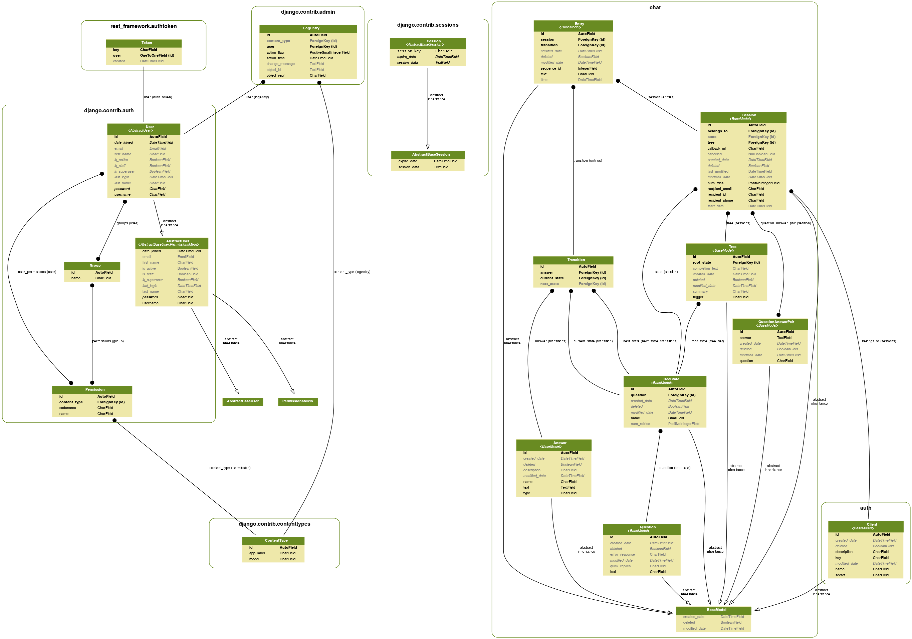

# Chatbot Web API

## Setup/Installation
Following doc provides necessary steps to setup and run chatbot in your local machine

### Requirements
<ul>
<li>**Python 3**</li>
<li>**Git**</li>
</ul>

### Installation
>NOTE: Make sure you have a configured git account.

```
$ mkdir chatbox && cd chatbox
$ virtualenv .
$ source bin/activate
$ git clone http://code.launchyard.com/root/chatbot.git
$ pip install -r requirements/local.txt
```

### Configuration

Setup parser.env based on environment(dev, staging, production). This should contains every environment variable mentioned in settings/base.py.

```
export CHATBOT_DBNAME=chatbot
export CHATBOT_DBUSER=launchyard
export CHATBOT_DBPASSWORD=launchyard
export CHATBOT_DBHOST=localhost

export CHATBOT_FB_PAGE_ACCESS_TOKEN=EAATlAEoSaTQBAL66HkhAbskaZCxGYOL4iuTHZAacmBQz9hYC924DVOZAZBpPiqaFpkCqjZCMgZB4Ox4oJ4P88jkpZA6buIeonXPAEKTVkZBWMNfXIpWWrH4TLEJ83OJNcIECybY4HUgVVGKPteQqqXQuqlOmEvGcnk73bHXpiFx9wwZDZD

export CHATBOT_FB_PAGE_ID=128922990987384

export DJANGO_EMAIL_HOST_PASSWORD=blahblah
export TWILIO_ACCOUNT_SID=AC1fa1da52c274630cadf58d01ec5e0c15
export TWILIO_AUTH_TOKEN=f20568638496d4a7c6ba3fa3ab88001a
export DEFAULT_FROM_SMS=+14157920382
```

### Running Server 

```
$ ./manage.py runserver
```

### Firing up celery

```
$ celery -A chatbot worker -l info
```

### Run docs

```
$ cd chatbot-docs
$ mkdocs serve
```

### Facebook Webhook Setup

Visit [Facebook Webhook reference](https://developers.facebook.com/docs/messenger-platform/webhook-reference#setup) and setup your messenger platform webhook.

### Project Structure

#### Database Design:



#### Project Tree

```
|-- auth
|   |-- admin.py
|   |-- apps.py
|   |-- common.py
|   |-- constants.py
|   |-- generators.py
|   |-- migrations
|   |   |-- 0001_initial.py
|   |-- models.py
|   |-- serializers.py
|   |-- tests.py
|   |-- urls.py
|   |-- views.py
|-- base
|   |-- admin.py
|   |-- apps.py
|   |-- __init__.py
|   |-- migrations
|   |-- models.py
|   |-- tests.py
|   `-- views.py
|-- casual.py
|-- chat
|   |-- admin.py
|   |-- apps.py
|   |-- bot.py
|   |-- constants.py
|   |-- converters.py
|   |-- emails.py
|   |-- helpers.py
|   |-- management
|   |   |-- commands
|   |   |   `-- test_chat.py
|   |-- migrations
|   |   |-- 0001_initial.py
|   |   |-- 0002_auto_20170911_1651.py
|   |   |-- 0003_question_question_type.py
|   |   |-- 0004_auto_20170914_1535.py
|   |   |-- 0005_auto_20170919_0756.py
|   |-- models.py
|   |-- permissions.py
|   |-- responses.py
|   |-- serializers.py
|   |-- tasks.py
|   |-- templates
|   |   `-- webview.html
|   |-- tests
|   |-- tests.py
|   |-- urls.py
|   |-- utils
|   |-- validators.py
|   |-- views.py
|-- chatbot
|   |-- celery.py
|   |-- settings
|   |   |-- base.py
|   |   |-- dev.py
|   |   |-- production.py
|   |   |-- staging.py
|   |   `-- testing.py
|   |-- urls.py
|   |-- wsgi.py
|-- chatbot_db.png
|-- chatbot-docs
|   |-- docs
|   |   |-- api-guide
|   |   |   |-- client.md
|   |   |   |-- initiate-chat.md
|   |   |   |-- session.md
|   |   |   |-- structured-data.md
|   |   |   |-- tree.md
|   |   |   |-- types.md
|   |   |   `-- webhook.md
|   |   |-- img
|   |   |   `-- chatbot_db.png
|   |   |-- index.md
|   |   `-- Setup.md
|   `-- mkdocs.yml
|-- cmd
|   `-- server.go
|-- fixtures
|   |-- all_locations.json
|   |-- chat.json
|   |-- default_user.json
|-- manage.py
|-- medium
|   |-- facebook.py
|   |-- medium.py
|   `-- tests
|       |-- test_facebook.py
|-- nlp
|   |-- wit.py
|-- test.json
`-- utils
    |-- common.py
```
